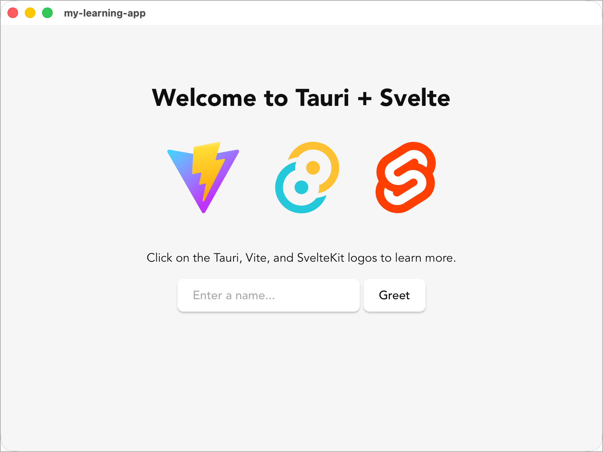

# 🛠️ 00. 환경 구축 (Environment Setup)

## 🎯 학습 목표 (Goal)
Tauri v2 앱 개발에 필요한 **Node.js, Rust 컴파일러, 그리고 OS별 필수 빌드 도구**를 완벽하게 설치하고, 첫 번째 `Hello World` 프로젝트를 구동할 수 있습니다.

---

## 💡 핵심 개념 (Core Concepts)

Tauri는 언어 혼합 프레임워크입니다. 
- **프론트엔드 (UI):** HTML, CSS, JavaScript(TypeScript) 등 웹 브라우저가 이해하는 기술
- **백엔드 (Core):** OS와 직접 소통하며 파일 시스템, 프로세스 등 시스템 권한을 제어하는 **Rust**

따라서 두 생태계의 패키지 매니저가 모두 돌아갈 수 있는 환경이 필수입니다.
- **pnpm** — npm을 대체하는 고성능 패키지 매니저. 디스크 공간 절약과 빠른 설치 속도가 장점입니다. 프론트엔드 라이브러리 설치 및 스크립트 실행 (`pnpm install`, `pnpm dev`)
  ```bash
  # pnpm 설치 (Node.js가 설치된 상태에서)
  npm install -g pnpm
  ```
- **Cargo** — Rust 공식 패키지 매니저 겸 빌드 시스템. 크레이트(라이브러리) 의존성 관리, 컴파일, 테스트를 통합 수행 (`cargo build`, `cargo run`)

---

## 💻 단계별 환경 설정

### Step 1: 시스템 필수 도구 (OS별 빌드 의존성) 설치

Tauri는 네이티브 데스크톱 앱을 빌드하므로 C/C++ 컴파일러 및 플랫폼별 렌더러 헤더 파일이 필요합니다.

#### 🍎 macOS
터미널을 열고 Xcode Command Line Tools를 설치합니다. 설치되어 있다면 이미 설치되었다고 뜹니다.
```bash
xcode-select --install
```

#### 🪟 Windows
1. [Build Tools for Visual Studio 2022](https://visualstudio.microsoft.com/ko/visual-cpp-build-tools/) 다운로드 후 실행.
2. **"C++를 사용한 데스크톱 개발"** (Desktop development with C++) 옵션을 체크하고 설치합니다.
3. WebView2 런타임이 필요하지만 Windows 11에는 기본 설치되어 있습니다. (Windows 10 구버전이라면 설치 권장)

#### 🐧 Linux (Ubuntu 22.04 이상 기준)
터미널에서 필수 라이브러리(`webkit2gtk`, `appmenu-gtk` 등)를 설치합니다.
```bash
sudo apt update
sudo apt install libwebkit2gtk-4.1-dev \
    build-essential \
    curl \
    wget \
    file \
    libxdo-dev \
    libssl-dev \
    libayatana-appindicator3-dev \
    librsvg2-dev
```

---

### Step 2: Rust (rustup) 설치

Rust 언어의 컴파일러와 패키지 매니저인 `cargo`를 설치하는 표준 방법입니다.

**macOS & Linux:**
```bash
curl --proto '=https' --tlsv1.2 -sSf https://sh.rustup.rs | sh
# 설치 후 터미널을 껐다 켜거나 아래 명령어를 치세요
source $HOME/.cargo/env
```

**Windows:**
[rustup-init.exe](https://win.rustup.rs/)를 다운로드하고 실행하여 지시사항(기본값 1번)에 따라 설치합니다.

✅ **설치 확인:**
```bash
rustc --version
cargo --version
```

---

### Step 3: Node.js 세팅

프론트엔드 빌드를 위해 필요합니다. 시스템에 이미 18.x 이상이 설치되어 있다면 생략해도 좋습니다(nvm 사용을 권장합니다).

✅ **설치 확인:**
```bash
node -v
npm -v
```

---

## 🛠️ 실습: 첫 번째 Tauri 프로젝트 스캐폴드(Scaffold)

환경 세팅이 끝났으니 텅 빈 폴더에서 보일러플레이트를 뽑아냅니다.

```bash
# 1. Tauri 프로젝트 생성 마법사 실행
pnpm create tauri-app@latest

# 프롬프트 예시:
# ✔ Project name · my-first-tauri
# ✔ Identifier · com.mycompany.my-first-tauri
# ✔ Choose which language to use for your frontend · TypeScript / JavaScript
# ✔ Choose your package manager · pnpm
# ✔ Choose your UI template · Svelte
# ✔ Choose your UI flavor · TypeScript

# 2. 디렉터리로 이동 후 프론트 패키지 설치
cd my-first-tauri
pnpm install

# 3. 개발 서버 실행! 
# (최초 실행 시 Rust 패키지를 다운받고 컴파일하느라 1~3분 정도 걸립니다)
pnpm tauri dev
```



> **🎉 축하합니다!** 웹뷰 기반의 독립된 창이 떴다면 개발 준비가 완벽히 끝난 것입니다.

---

## 🚀 마무리 및 다음 단계

개발 서버를 열어놓은 상태에서 `index.html`을 수정하고 저장하면(HMR), 브라우저처럼 즉각 창의 내용이 바뀝니다.
하지만 "이게 도대체 어떻게 돌아가는 거지?"라는 의문이 들 수 있습니다.
다음 장 [**01. Tauri 아키텍처와 생명주기**](./01-tauri-architecture.md)에서 Tauri가 어떻게 웹과 OS를 이어주는지, 폴더 구조는 어떻게 되어 있는지 파헤쳐 보겠습니다.
