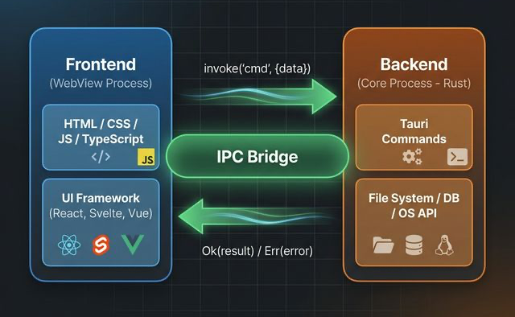

# 🏛️ 01. Tauri 아키텍처와 디렉터리 구조

## 🎯 학습 목표 (Goal)
Tauri 프로젝트 내부의 프론트엔드/백엔드 분리 구조를 파악하고, 웹뷰(WebView) 프로세스와 Core(Rust) 메인 프로세스가 어떻게 협력하여 데스크톱 앱을 구성하는지 이해합니다.

---

## 💡 핵심 개념 (Core Concepts): 2-Process Model

Electron이나 Tauri와 같은 모던 데스크톱 프레임워크는 보통 **멀티 프로세스 모델**을 취합니다. Tauri는 크게 2가지 영역으로 나뉩니다.

1. **프론트엔드 (WebView 렌더러 프로세스)**
   - UI를 그리는 역할을 합니다. 여러분이 작성한 HTML/CSS/JS가 실행되는 곳입니다.
   - OS 고유의 웹엔진(macOS: `WebKit`, Windows: `WebView2`, Linux: `WebKitGTK`)을 사용하므로, Electron처럼 무거운 크로미움(Chromium)을 통째로 압축해 배포할 필요가 없어 **빌드 용량이 매우 작습니다(수 MB대).**
2. **백엔드 (Core 메인 프로세스)**
   - 앱이 처음 시작될 때 기동되는 실제 OS 프로세스이며, **Rust**로 작성됩니다.
   - 윈도우 창(Window)을 생성하고 관리하며, 트레이 아이콘을 띄우고, DB/파일시스템 등의 OS 권한이 필요한 핵심 로직을 담당합니다.

이 둘은 서로 안전하게 격리되어 있으며, 오직 **IPC (Inter-Process Communication)**라는 터널을 통해서만 메시지를 주고받습니다. (이 개념은 06번 IPC 문서에서 배웁니다.)



---

## 📂 실습: 디렉터리 구조 해부 (Hands-on)

`pnpm create tauri-app`으로 만든 프로젝트를 VS Code 같은 에디터로 열어보세요. 아래 파일들을 직접 클릭해 보며 구조를 파악합니다.

### 1. 프론트엔드 영역 (Roots)
이 파일들은 웹 브라우저 개발과 100% 동일합니다.
- `index.html` : UI의 진입점.
- `src/` : (설정에 따라) JS, TS 혹은 기타 컴포넌트(Svelte, React 등)가 담기는 곳입니다.
- `package.json` : 프론트엔드 의존성 및 스크립트. (`pnpm tauri dev` 구동을 위해 여기서 `tauri` CLI가 호출됩니다.)

### 2. 백엔드 (Rust Core) 영역 🦀
진짜 중요한 부분은 새로 생성된 **`src-tauri/`** 폴더 내부입니다. 앱의 '뇌' 역할을 합니다.

```text
src-tauri/
├── Cargo.toml          // npm의 package.json과 같습니다. Rust 패키지(크레이트) 의존성을 관리합니다.
├── tauri.conf.json     // [중요!] Tauri 앱의 설정 파일. 창 크기, 앱 이름, 빌드 설정, 보안 정책 등이 저장됩니다.
└── src/
    ├── main.rs         // Rust 백엔드 진입점 파일!
    └── lib.rs          // (v2부터 분리됨) 메인 로직이 캡슐화되는 라이브러리 파일.
```

### 🛠 코드 열어보기

`src-tauri/src/lib.rs` (또는 `main.rs`) 파일을 열어보세요. 다음과 비슷한 뼈대가 보일 것입니다.

```rust
// [ src-tauri/src/lib.rs ]
#[tauri::command]
fn greet(name: &str) -> String {
    format!("Hello, {}! You've been greeted from Rust!", name)
}

#[cfg_attr(mobile, tauri::mobile_entry_point)]
pub fn run() {
    // Tauri 앱 구동 시작 (1) 빌더 생성
    tauri::Builder::default()
        // (2) 플러그인 초기화 등 (v2부터 기본 로거 등이 포함됨)
        .plugin(tauri_plugin_shell::init())
        // (3) 프론트엔드에서 호출할 수 있도록 함수 등록
        .invoke_handler(tauri::generate_handler![greet]) 
        // (4) 앱 컨텍스트(tauri.conf.json 등)를 주입하고 실제 실행!
        .run(tauri::generate_context!())
        .expect("error while running tauri application");
}
```

이 코드가 바로 렌더러(프론트엔드) 창을 띄우고, 백그라운드에서 무한히 돌며 이벤트를 대기하는 메인 서버인 셈입니다.

---

## 🚀 마무리 및 다음 단계

이제 내가 JS나 UI 프레임워크를 다루는 폴더(`src`)와, 실제 OS 권한을 가진 시스템을 다루는 폴더(`src-tauri`)가 나뉘어 있다는 점을 알았습니다.

하지만 C계열 언어를 안 해봤다면 `src-tauri`에 있는 저 낮선 `&str`, `format!`, `#[tauri::command]` 기호들이 눈에 아른거릴 것입니다.
Rust의 러닝커브는 높기로 유명하지만, Tauri 개발에 필요한 Rust 수준은 생각보다 깊지 않습니다!
다음 장 [**02. Rust 기초 문법**](./02-rust-basics.md)에서 변수, 타입, 함수, 제어흐름 등 핵심 기초를 빠르게 익혀보겠습니다.
