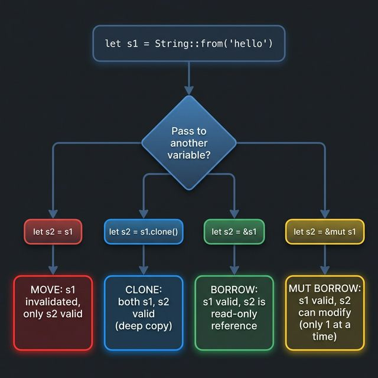

# 🔑 03. 소유권과 참조 (Ownership & Borrowing)

## 🎯 학습 목표 (Goal)
Rust의 가장 독특한 개념인 **소유권(Ownership), 빌림(Borrowing), 라이프타임(Lifetime)**을 이해하고, Tauri 코드에서 자주 등장하는 `&str`, `String`, `State<'_, T>` 표기의 의미를 파악합니다.

---

## 💡 핵심 개념 (Core Concepts)

### 왜 소유권이 필요한가?
C/C++에는 메모리 해제를 개발자가 직접 하다가 버그(메모리 릭, 해제 후 재참조 등)가 발생합니다.
Java/Python/JS에는 가비지 컬렉터(GC)가 자동으로 치우지만 성능 저하(Stop-the-World)가 존재합니다.
Rust는 **컴파일 시점에 소유권 규칙으로 메모리 안전성을 보장**합니다. GC도 없고, 수동 해제도 없습니다!

> **🐍 Python과 비교:** Python은 **참조 카운팅(Reference Counting) + GC**로 메모리를 자동 관리합니다. 편리하지만 순환 참조 문제, GC 일시 정지 등의 약점이 있습니다. Rust는 이런 런타임 오버헤드 없이 컴파일 단계에서 메모리 문제를 원천 차단하여 C++ 수준의 성능을 냅니다.

---



### 소유권 3대 규칙 ⭐

```rust
fn main() {
    // 📌 규칙 1: 모든 값에는 '주인(Owner)'이 정확히 하나 있다.
    let s1 = String::from("안녕하세요"); // s1이 이 String의 주인

    // 📌 규칙 2: 주인이 범위(scope)를 벗어나면 값은 자동으로 메모리에서 정리(drop)된다.
    {
        let temp = String::from("잠깐");
        println!("{}", temp);
    } // ← 여기서 temp가 scope 밖으로 나감 → 메모리 자동 해제! (free)

    // 📌 규칙 3: 한 시점에 주인은 반드시 하나. 대입(=) 시 소유권이 '이동(Move)'한다.
    let s2 = s1;  // s1의 소유권이 s2로 이동(Move)!
    // println!("{}", s1); // ❌ 컴파일 에러! s1은 더 이상 주인이 아님(무효화됨)
    println!("{}", s2); // ✅ s2만 유효
}
```

> **💡 비유:** 소유권 이동(Move)은 "책을 남에게 넘기는 것"과 같습니다. 넘기고 나면 내 손에는 아무것도 없습니다.

> **🐍 Python과 비교:** Python에서 `a = [1,2,3]; b = a`를 하면 a와 b는 **같은 리스트를 공유**(참조 복사)합니다. 둘 다 유효하고 한쪽을 수정하면 다른 쪽도 바뀝니다.
> Rust에서 `let b = a;`를 하면 `a`의 소유권이 `b`로 **이동(Move)**되고 `a`는 사용 불가가 됩니다. 공유하려면 `&`(참조)를 명시적으로 써야 합니다. 이 차이가 Rust가 데이터 경쟁(Data Race)을 원천 차단하는 핵심입니다.

---

### 이동(Move) vs 복사(Copy)

```rust
fn main() {
    // 🔸 힙(Heap) 할당 타입 (String, Vec 등): '이동(Move)'됨
    let a = String::from("hello");
    let b = a;  // Move! a는 무효화
    // println!("{}", a); // ❌ 에러

    // 🔹 스택(Stack) 타입 (정수, 실수, bool, char 등): '복사(Copy)'됨
    let x: i32 = 42;
    let y = x;  // Copy! x도 여전히 유효
    println!("x={}, y={}", x, y); // ✅ 둘 다 유효

    // 💡 힙 타입을 명시적으로 복사하고 싶다면 `.clone()` 사용
    let original = String::from("원본");
    let copied = original.clone(); // 깊은 복사(Deep Copy)
    println!("원본={}, 복사={}", original, copied); // ✅ 둘 다 유효
}
```

---

### 참조(Borrowing, `&`)와 가변 참조(`&mut`)

소유권을 넘기지 않고 "잠시 빌려본다"는 개념입니다.

> **🐍 Python과 비교:** Python에서는 함수에 리스트를 넘기면 원본이 직접 전달(참조 전달)되어, 함수 안에서 `.append()` 등으로 수정하면 원본도 바뀝니다 — 의도치 않은 부작용(Side Effect)의 온상입니다.
> Rust는 `&`(읽기 전용 빌림) vs `&mut`(수정 가능 빌림)을 문법 수준에서 구분하여, "이 함수가 내 데이터를 수정할 수 있는가?"를 함수 시그니처만 보고도 즉시 알 수 있습니다.

```rust
// ✅ 불변 참조(&): "보기만 할게, 수정 안 해" (여러 곳에서 동시에 빌릴 수 있음)
fn calculate_length(s: &String) -> usize {
    s.len()
    // 이 함수가 끝나도 s의 소유권은 원래 주인에게 유지됨
}

// ✅ 가변 참조(&mut): "수정할 거야!" (한 번에 하나만 빌릴 수 있음)
fn add_greeting(s: &mut String) {
    s.push_str(", 반갑습니다!");
}

fn main() {
    let mut message = String::from("안녕하세요");

    // 불변 참조: 여러 개 동시 가능
    let len = calculate_length(&message);
    println!("길이: {}", len);

    // 가변 참조: 한 번에 하나만!
    add_greeting(&mut message);
    println!("{}", message); // "안녕하세요, 반갑습니다!"
}
```

> **🔒 Rust의 철칙:** 
> 한 시점에 **불변 참조 여러 개 OR 가변 참조 딱 1개**만 존재할 수 있습니다.
> 이 제약 덕분에 데이터 경쟁(Data Race)이 컴파일 단계에서 원천적으로 차단됩니다!

---

### `String` vs `&str` (심화)

Tauri 코드를 짤 때 이 둘의 차이가 가장 많이 당혹감을 줍니다.

> **🐍 Python과 비교:** Python에서 `str`은 하나뿐이고 불변(immutable)입니다. `s = "hello"; s += " world"` 는 기존 문자열을 수정하는 게 아니라 새 문자열 객체를 만드는 것입니다.
> Rust에서는 이 역할이 둘로 나뉩니다:
> | Python | Rust | 설명 |
> |---|---|---|
> | `"hello"` (str 리터럴) | `"hello"` (`&str`) | 고정된 텍스트, 읽기 전용 |
> | `str` 변수 | `String` | 힙에 할당, 자유롭게 수정 가능 |
> | `s + " world"` (새 객체) | `s.push_str(" world")` | String은 제자리 수정 가능! |

```rust
fn main() {
    // &str (문자열 슬라이스, 참조): 고정된 텍스트. 수정 불가. "보기 전용 포스터"
    let literal: &str = "변하지 않는 문자열";

    // String (소유된 문자열): 자유롭게 변경 가능한 "화이트보드"
    let mut dynamic = String::from("변할 수 있는 ");
    dynamic.push_str("문자열");

    // Tauri에서의 적용:
    // - JS에서 Rust로 데이터가 넘어올 때: &str로 '빌려옴'
    //   #[tauri::command]
    //   fn greet(name: &str) -> String { ... }
    //               ^^^^                ^^^^^^
    //           빌려서 Reading only     새로 만들어서 JS에 돌려줌 (소유권 전달)

    // &str → String 변환
    let owned: String = literal.to_string();  // 또는 String::from(literal)

    // String → &str 변환 (자동 역참조 동작)
    let borrowed: &str = &owned;  // 또는 owned.as_str()
}
```

---

### 라이프타임 (`'a`, `'_`) — 참조의 유효기간 표시

라이프타임은 "이 참조가 얼마나 오래 유효한지" 를 컴파일러에게 알려주는 메타데이터입니다.
대부분은 컴파일러가 자동으로 추론하지만, 때때로 명시해야 할 때가 있습니다.

```rust
// 라이프타임을 명시하는 경우: 두 참조 중 어떤 게 더 오래 사는지 컴파일러가 모를 때
fn longer_str<'a>(s1: &'a str, s2: &'a str) -> &'a str {
    // 'a 는 "s1과 s2의 수명 중 더 짧은 쪽"을 의미
    if s1.len() >= s2.len() { s1 } else { s2 }
}

fn main() {
    let result;
    let string1 = String::from("긴 문자열입니다");
    {
        let string2 = String::from("짧은");
        result = longer_str(&string1, &string2);
        println!("더 긴 쪽: {}", result);
    }
}
```

**Tauri에서 `'_`를 보게 되는 곳:**
```rust
use tauri::State;

// State<'_, AppState> 에서 `'_`는
// "라이프타임을 컴파일러야 네가 알아서 추론해줘"라는 와일드카드입니다.
// 초심자는 "'_' = 자동 추론"이라고 외우면 충분합니다!
#[tauri::command]
fn my_command(state: State<'_, AppState>) -> String {
    // ...
    "ok".into()
}
```

---

## 🚀 마무리 및 다음 단계

소유권은 Rust의 가장 큰 허들이자 가장 큰 무기입니다. 처음엔 컴파일러에게 자주 혼나겠지만, 이 규칙 덕분에 C/C++처럼 메모리 버그로 밤새 디버깅하는 일은 없어집니다!

Tauri 코드를 짜다 보면 데이터를 묶는 구조체(`struct`), 경우의 수를 나타내는 열거형(`enum`), 그리고 `#[derive(Serialize, Clone)]` 같은 트레이트(Trait)를 필연적으로 마주치게 됩니다.
다음 장 [**04. 구조체, 열거형, 트레이트**](./04-structs-enums-traits.md)에서 이 Rust 고유의 타입 시스템을 파헤쳐 봅시다.
