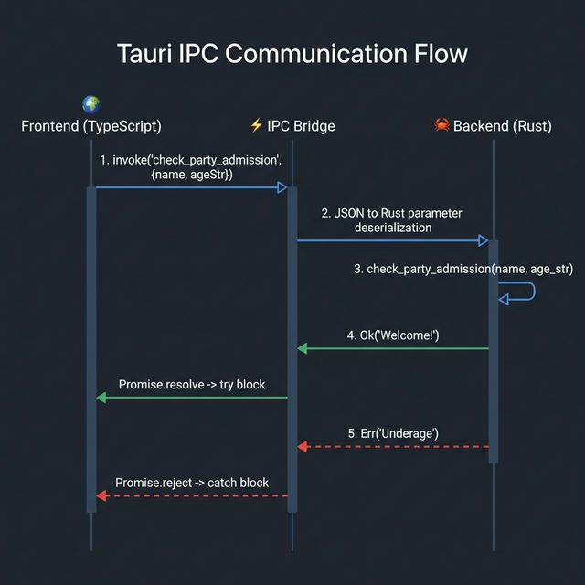

# 🔌 03. IPC & Commands 통신

## 🎯 학습 목표 (Goal)
Tauri의 핵심인 IPC (Inter-Process Communication) 매커니즘을 이해하고, TypeScript 프론트엔드에서 Rust 함수를 비동기적으로 호출하여 데이터를 주고받는 방법을 배웁니다.

---

## 💡 핵심 개념 (Core Concepts)

### 웹 브라우저 환경의 한계
일반적인 브라우저(Chrome, Safari 등)에서 실행되는 JavaScript 샌드박스는 보안상의 이유로 **로컬 파일 읽기, 임의의 터미널 명령어 실행, 메모리 집접 제어** 등을 할 수 없습니다.

### 브릿지(Bridge)로써의 Tauri
Tauri는 프론트엔드 화면 안에 `window.__TAURI__` 라는 숨겨진 객체를 주입합니다. 이를 통해 **TypeScript 코드가 마치 로컬 백엔드 서버에 HTTP/WebSocket 통신을 하듯 OS 고유의(Native) 능력을 지닌 Rust 함수에게 요청(Invoke)**을 보낼 수 있습니다.
이러한 통신과정을 **IPC 통신**이라 부릅니다.

- **(프론트) TS**: `invoke("명령어", { 데이터 })`로 요청을 보냄 (Promise 반환)
- **(백엔드) Rust**: `#[tauri::command]` 매크로가 붙은 함수가 요청을 수신 및 처리 후, `Ok`나 `Err`로 결과 반환!



---

## 💻 실습: Rust와 TS 간의 파라미터 전달 (Hands-on)

앞선 2강에서 Rust 쪽에 `check_party_admission` 함수를 만들고 등록해두었습니다. 이번에는 프론트엔드(UI) 작업을 진행합니다.
Svelte로 스캐폴딩한 프로젝트 기준으로 설명합니다. 기본 원리는 **Promise(비동기 로직) 대기**입니다.

### Step 1: 프론트엔드 호출 코드 작성 

프론트엔드 로직이 들어있는 Svelte 컴포넌트 파일 `src/routes/+page.svelte`를 열어보세요.

```svelte
<!-- src/routes/+page.svelte -->
<script lang="ts">
  // 1. Tauri가 제공하는 invoke 함수 임포트
  // (만약 에러가 난다면 $ pnpm add @tauri-apps/api 먼저 실행)
  import { invoke } from "@tauri-apps/api/core";

  // Svelte 반응성 변수로 UI 상태 관리
  let nameVal = $state('');
  let ageVal = $state('');
  let resultMsg = $state('');
  let resultColor = $state('');

  async function requestAdmission() {
    try {
      // 2️⃣ Rust로 IPC Invoke 호출!!
      // 첫 번째 인자: Rust 함수 이름 (문자열 그대로)
      // 두 번째 인자: [중요] 변수를 담은 객체. 키 이름은 Rust 함수의 매개변수 이름과 정확히 일치해야 합니다. (name, age_str)
      const response: string = await invoke("check_party_admission", {
        name: nameVal,
        ageStr: ageVal // ✨ 주의하세요! Rust 쪽에선 `age_str`로 snake_case 지만, 
                       // 프론트엔드에서 camelCase(ageStr)로 보내면, Tauri가 매크로 내부에서 알아서 Rust의 snake_case(age_str)로 치환해줍니다.
      });

      // Rust가 `Ok(..)`를 반환하면 try 블록에서 받아집니다.
      resultMsg = "✅ 성공: " + response;
      resultColor = "green";

    } catch (error) {
      // 3️⃣ Rust가 에러! 즉 `Err(..)`를 반환했다면 통신 자체는 성공했으나
      // Promise가 Reject되어 catch 블록으로 떨어집니다.
      resultMsg = "❌ 거절됨: " + error;
      resultColor = "red";
    }
  }
</script>

<!-- Svelte 템플릿 -->
<div>
  <input type="text" placeholder="이름 입력" bind:value={nameVal} />
  <input type="text" placeholder="나이(숫자만)" bind:value={ageVal} />
  <button type="button" onclick={requestAdmission}>입장 신청확인</button>
  <p style:color={resultColor}>{resultMsg}</p>
</div>
```

---

## 🚀 마무리 및 다음 단계

이것이 전부입니다! 핵심은 `invoke("함수명", { 파라미터들 })` 입니다. 이 방법을 통해 파일을 저장하거나 시스템 정보를 읽는 등, **프론트엔드에서 생각할 수 있는 거의 모든 OS 작업을 Rust에게 외주를 줄 수 있습니다.**

하지만 단순한 입력/출력 핑퐁만으로 큰 앱을 만들면 문제가 생깁니다.
**"앱 전체에서 공유되는 데이터베이스 연결을 어떻게 유지하지?"**
**"카운터 앱을 만들었는데 숫자를 Rust쪽 메모리에 계속 저장해두고 싶다면?"** 

다음 장 [**07. 상태 관리 (State Management)**](./07-state-management.md)에서 Tauri 백엔드 메모리에 데이터를 영구히 띄워놓고 제어하는 방법을 배웁니다.
