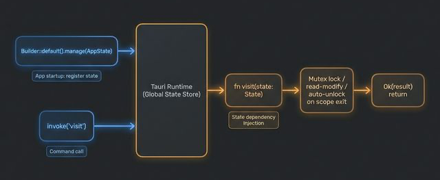

# 📦 04. 상태 관리 (State Management)

## 🎯 학습 목표 (Goal)
Tauri 백엔드(Rust)에서 애플리케이션의 생명주기 동안 데이터를 메모리에 상주시키고, 프론트엔드의 요청에 따라 안전하게 상태를 읽고 쓰는 방법을 배웁니다.

---

## 💡 핵심 개념 (Core Concepts)

### 왜 "상태 관리"가 필요할까요?
프론트엔드(React/Svelte/Vue 등)에도 상태 관리가 있지만, 브라우저가 새로고침되면 날아가거나 보안상 민감한 정보(API 키, 로컬 DB 커넥션 풀)를 담기엔 적절하지 않습니다.
Tauri는 Rust 쪽 메모리에 **全局(Global) 상태**를 띄워두고 프론트엔드가 이를 조작할 수 있도록 해줍니다.

### `Mutex` (Mutual Exclusion, 상호 배제)
JavaScript는 싱글 스레드라 비동기 콜백이 겹쳐도 메모리가 꼬이지 않습니다. 하지만 **Rust는 기본적으로 멀티 스레드**로 동작합니다!
여러 프론트엔드 창에서 동시에 같은 Rust 변수를 수정하려고 하면 충돌(Data Race)이 발생합니다.
따라서 상태를 사용할 때는 무조건 **`Mutex`**(또는 `RwLock`)라는 자물쇠로 데이터를 잠그고, 한 번에 한 스레드만 접근할 수 있게 만들어야 합니다.

> **🐍 Python과 비교:** Python에는 GIL(Global Interpreter Lock)이 있어 스레드 간 데이터 충돌이 표면적으로 덜 드러나지만, 진정한 병렬 처리는 안 됩니다.
> Rust는 GIL이 없는 대신 `Mutex`를 명시적으로 사용하여 데이터 안전성을 보장하면서도 **진짜 병렬 멀티스레딩**을 지원합니다.
> | Python | Rust |
> |---|---|
> | `threading.Lock()` | `std::sync::Mutex` |
> | `with lock:` (컨텍스트 매니저) | `.lock()` (scope 벗어나면 자동 해제) |
> | GIL이 암묵적 보호 | 명시적 Mutex/RwLock 필수 |



---

## 💻 실습: 방문자 카운터 만들기 (Hands-on)

`src-tauri/src/lib.rs` 파일을 수정하여 카운터를 관리해봅시다.

### Step 1: 상태 구조체 정의
```rust
// src-tauri/src/lib.rs
use std::sync::Mutex; 
use tauri::State;

// 1️⃣ 관리할 상태 구조체 정의
// 카운터 값을 담고, 동시에 여러 요청이 와도 꼬이지 않도록 Mutex로 감쌉니다!
struct AppState {
    visitor_count: Mutex<u32>,
}
```

### Step 2: 상태를 주입(Inject)받는 Command 생성
```rust
// 2️⃣ 상태를 매개변수로 받는 커맨드
// 함수 인자에 `state: State<'_, AppState>`를 적으면 
// Tauri가 알아서 우리가 등록한 상태를 찾아 넣어줍니다.
#[tauri::command]
fn visit(state: State<'_, AppState>) -> Result<u32, String> {
    
    // Mutex 자물쇠 열기 (lock)
    // 락을 얻는 데 실패할 경우 프론트엔드로 에러를 보내기 위해 map_err 사용
    let mut count = state.visitor_count.lock().map_err(|_| "상태를 락(Lock)하는데 실패했습니다.")?;
    
    // 값 증가 (*를 붙여 실제 값에 접근)
    *count += 1;
    
    // 증가된 값 반환. 
    // scope를 벗어나면 Mutex는 알아서 락을 풉니다! (Rust의 소유권 마법)
    Ok(*count)
}
```

### Step 3: Builder에 초기 상태 등록하기 [중요!]
```rust
// 3️⃣ 메인 앱 구동부에 상태 등록
#[cfg_attr(mobile, tauri::mobile_entry_point)]
pub fn run() {
    tauri::Builder::default()
        // manage() 함수로 초기 상태값을 앱에 등록합니다. 
        // [주의] 이걸 안 하면 커맨드 호출 시 패닉(강제종료)이 발생합니다.
        .manage(AppState {
            visitor_count: Mutex::new(0),
        })
        .invoke_handler(tauri::generate_handler![visit])
        .run(tauri::generate_context!())
        .expect("error while running tauri application");
}
```

### Step 4: 프론트엔드에서 호출하기 (`src/main.ts`)
```typescript
import { invoke } from "@tauri-apps/api/core";

async function doVisit() {
  try {
    // Rust의 visit 커맨드를 호출하고, 반환된 증가된 카운터 값을 받습니다.
    const currentCount = await invoke<number>("visit");
    console.log(`현재 총 방문 횟수: ${currentCount}`);
  } catch(e) {
    console.error(e);
  }
}
```

---

## 🚀 마무리 및 다음 단계

Rust의 `Mutex`와 `State` 파라미터를 이용하면, **앱 전역의 DB 연결 (Connection Pool)** 이나 캐시 메모리 등을 아주 깔끔하고 스레드-안전하게(Thread-safe) 관리할 수 있습니다.

지금까지는 **항상 프론트엔드가 먼저 요청(Invoke)** 해야만 Rust가 응답했습니다. 
하지만 만약 백그라운드에서 주기적으로 서버 상태를 체킹하거나, 대용량 파일 다운로드가 끝났을 때 **Rust가 프론트엔드에게 먼저 신호**를 주고 싶다면 어떡해야 할까요?
다음 장 [**08. 이벤트 시스템 (Event System)**](./08-event-system.md)에서 Pub/Sub 패턴의 진수를 배워봅시다.
