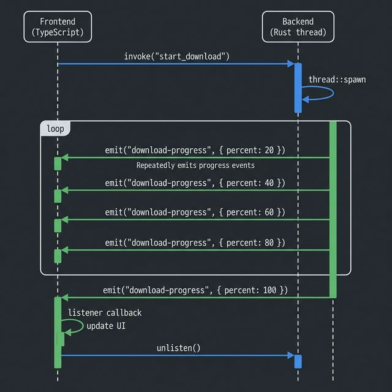

# 📡 05. 이벤트 시스템 (Event System)

## 🎯 학습 목표 (Goal)
프론트엔드와 백엔드가 서로의 요청을 기다리지 않고, 일방적으로 메시지를 쏘고(Emit) 받는(Listen) 비동기 Pub/Sub 패턴을 마스터합니다.

---

## 💡 핵심 개념 (Core Concepts)

`invoke` 는 "명령 → 처리 → 기다림 → 결과 반환" 이라는 동기적 흐름을 갖습니다. 반면 분리된 프로세스 간에 **진정한 비동기 처리**가 필요한 경우가 있습니다.

- 다운로드 프로그레스 바 갱신 (1%, 2%, 3% ...)
- 로컬 디렉터리 시스템의 파일 변경 감지 알림
- 시스템 소켓(WebSocket 통신 등)에서 데이터가 푸쉬되는 경우

이럴 땐 백엔드나 프론트엔드 한쪽에서 특정 이름의 이벤트를 **방출(Emit)**하고, 다른 쪽에서는 **구독(Listen)**하는 방식을 씁니다.



---

## 💻 실습: 파일 처리 시뮬레이션 (Hands-on)

버튼을 누르면 백엔드에서 5초가 걸리는 파일 처리를 시작합니다. 이때 UI가 멈추지 않고, 1초마다 백엔드가 보낸 완료 퍼센티지를 받아 화면에 갱신해 보겠습니다.

### Step 1: 백엔드에서 이벤트 보내기 (Emit)

`src-tauri/src/lib.rs`를 엽니다.

```rust
use tauri::{AppHandle, Emitter};
use std::{thread, time::Duration};

// ✅ 이벤트 페이로드(보낼 데이터) 구조체 생성. 
// 프론트엔드(JS)로 JSON 변환되어 날아가야 하므로 serde의 Serialize가 필수입니다.
#[derive(serde::Serialize, Clone)]
struct ProgressPayload {
    message: String,
    percent: u8,
}

// ✅ 백그라운드 작업을 실행할 커맨드
// AppHandle을 인자로 받으면 현재 실행 중인 앱의 핸들을 제어할 수 있습니다.
#[tauri::command]
fn start_download(app: AppHandle) {
    // Rust 메인 스레드가 블록(멈춤)되지 않도록, 새로운 미니 스레드를 팝니다!
    thread::spawn(move || {
        for i in 1..=5 {
            thread::sleep(Duration::from_secs(1)); // 1초 대기
            
            // "download-progress" 라는 이름의 채널로 데이터를 쏩니다 (Emit)
            app.emit("download-progress", ProgressPayload {
                message: format!("파일을 다운로드 중입니다... ({} 초경과)", i),
                percent: i * 20,
            }).unwrap();
        }
        
        // 최종 다운로드 완료 이벤트 알림
        app.emit("download-progress", ProgressPayload {
            message: "다운로드 완료!".into(),
            percent: 100,
        }).unwrap();
    });
}
```

> **🔥 기억하기:** 백그라운드 반복 작업이나 지연 작업은 반드시 `thread::spawn` 안에 넣어야 합니다. 그렇지 않으면 Tauri UI 전체가 먹통(프리징)됩니다!

### Step 2: 프론트엔드에서 수신하기 (Listen)

Svelte 컴포넌트에서 이벤트를 구독합니다.

```svelte
<!-- src/routes/+page.svelte -->
<script lang="ts">
  import { invoke } from "@tauri-apps/api/core";
  import { listen } from "@tauri-apps/api/event";
  import { onMount, onDestroy } from 'svelte';

  // 백엔드의 ProgressPayload 구조체와 모양이 똑같은 TS 인터페이스 생성
  interface ProgressPayload {
    message: string;
    percent: number;
  }

  // Svelte 반응성 변수로 UI 상태 관리
  let statusText = $state('대기 중...');
  let progressValue = $state(0);

  let unlisten: (() => void) | null = null;

  onMount(async () => {
    // "download-progress" 이벤트를 듣고 있는 리스너 부착
    unlisten = await listen<ProgressPayload>("download-progress", (event) => {
      // event.payload 안에 백엔드에서 보낸 구조체가 파싱되어 들어있습니다.
      console.log(`수신됨: ${event.payload.percent}%`);
      statusText = event.payload.message;
      progressValue = event.payload.percent;
    });
  });

  onDestroy(() => {
    // 컴포넌트가 사라질 때 메모리 누수를 막기 위해 구독 해제(Unlisten)
    if (unlisten) unlisten();
  });

  function startDownload() {
    invoke("start_download"); // 이 커맨드는 백엔드에서 스레드를 띄우고 즉시 종료됨 (비동기 처리)
  }
</script>

<div>
  <button onclick={startDownload}>다운로드 시작</button>
  <p>{statusText}</p>
  <progress value={progressValue} max="100"></progress>
</div>
```

---

## 🚀 마무리 및 다음 단계

이제 프론트엔드와 백엔드가 서로 종속되지 않고 비동기적으로 대화할 수 있는 채널을 뚫었습니다. 이것만 알아도 사실상 Tauri 앱 구현의 절반이 끝났다고 볼 수 있습니다.

하지만 우리가 코드를 짜다 보면, `app.emit(...).unwrap()` 처럼 뒤에 `.unwrap()`을 붙이거나 `Result`를 리턴하며 에러를 던져야 할 때가 많습니다.
"에러가 나면 어떻게 예쁘게 프론트엔드로 전달하고 처리해야 할까?"
다음 장 [**09. 에러 핸들링 및 디버깅**](./09-error-handling.md)에서 Rust의 강력한 에러 타입 래핑을 배워봅니다.
