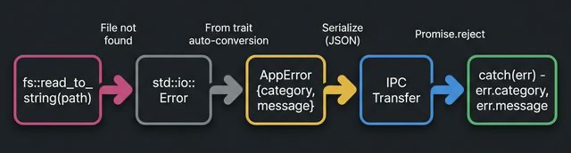

# 🚑 06. 에러 핸들링 및 디버깅

## 🎯 학습 목표 (Goal)
Tauri 백엔드(Rust)에서 발생한 에러를 애플리케이션 강제 종료(`panic!`) 없이, 안전하고 정돈된 JSON 형태로 프론트엔드(TypeScript)로 직렬화하여 넘겨주는 "사용자 정의 에러" 패턴을 익힙니다.

---

## 💡 핵심 개념 (Core Concepts)

Rust 코드 예제를 보다 보면 함수 끝이나 명령어 뒤에 `.unwrap()`이 붙은 것을 자주 볼 수 있습니다.
- **`unwrap()` 의 의미:** "에러가 발생할 리 없다고 확신해! 만약 에러면 앱 전체를 강제 종료(Panic)시켜버려!"

클라이언트에게 배포될 데스크톱 앱이 갑자기 `Panic`으로 픽 꺼져버리는 것은 최악의 사용자 경험입니다.
가장 이상적인 흐름은 다음과 같습니다.
1. 파일 읽기 실패 (Rust 에러 발생)
2. 에러를 `AppError` 라는 일관된 양식으로 변환 (직렬화)
3. 프론트엔드가 Promise의 `.catch(err)` 로 수신
4. 모달창이나 토스트 메시지로 "해당 경로에 파일이 없습니다." 띄우기

> **🐍 Python과 비교:** Python은 `try/except` 예외 처리를 사용합니다. Rust는 예외(Exception) 개념이 **없고**, 대신 `Result<T, E>` 반환값으로 에러를 명시적으로 처리합니다.
> ```python
> # Python: 에러가 어디서든 터지고, try로 잡지 않으면 프로그램 전체가 중단
> try:
>     content = open("file.txt").read()
> except FileNotFoundError as e:
>     print(f"에러: {e}")
> ```
> ```rust
> // Rust: 함수 반환값 자체가 "성공/실패"를 담고 있음. `?`로 전파 가능
> let content = fs::read_to_string("file.txt")?; // 실패 시 자동으로 Err 반환
> ```
> Rust의 장점: **"이 함수가 실패할 수 있는가?"**를 반환 타입(`Result`)만 보고도 즉시 알 수 있습니다. Python에서는 문서를 읽어야 어떤 예외가 나는지 알 수 있습니다.



---

## 💻 실습: 완벽한 사용자 정의 에러 타입 만들기 (Hands-on)

단순히 `Result<String, String>` 으로 에러 메시지만 문자열로 던지는 대신, 상태 코드와 메세지를 다 포함할 수 있는 **Custom Error** 타입을 만들어 봅시다.

### Step 1: Rust에서 Serialize 가능한 에러 구조체 만들기

`src-tauri/src/lib.rs`를 수정합니다. 프론트엔드로 날아가려면 데이터가 JSON 구조로 변환될 수 있어야 합니다. (이를 위해 `serde`가 필요합니다)

```rust
use serde::Serialize;
use std::fs;
use std::io;

// 1️⃣ 커스텀 에러 구조체 정의!
// 프론트엔드로 전송되어야 하므로 Serialize(직렬화) 매크로를 붙입니다.
// 이 구조가 JS에서 catch(err) 의 err 객체 자체가 됩니다.
#[derive(Debug, Serialize)]
pub struct AppError {
    category: String,
    message: String,
}

// 2️⃣ Rust 기본 라이브러리의 에러(예: std::io::Error)가 발생하면 
// 우리의 AppError로 자동 캐스팅(변환)되도록 From 트레이트를 구현합니다.
impl From<io::Error> for AppError {
    fn from(error: io::Error) -> Self {
        AppError {
            category: "FileSystem".into(),
            message: error.to_string(),
        }
    }
}

// 3️⃣ 에러를 던질 수 있는 커맨드 테스트
#[tauri::command]
fn read_secret_config(path: &str) -> Result<String, AppError> { // 👈 우리가 만든 AppError를 Err 타입으로 지정
    
    // 파일 읽기 시도. 파일이 없으면 io::Error가 발생하지만, 
    // `?` 연산자와 방금 위에서 만든 `From<io::Error>` 로직 덕분에
    // 자동으로 AppError로 예쁘게 포장되어 프론트엔드 Err()로 바로 날아갑니다!!
    let content = fs::read_to_string(path)?;
    
    // 성공 시 반환
    Ok(content)
}

#[cfg_attr(mobile, tauri::mobile_entry_point)]
pub fn run() {
    tauri::Builder::default()
        .invoke_handler(tauri::generate_handler![read_secret_config])
        .run(tauri::generate_context!())
        .expect("error while running tauri application");
}
```

### Step 2: 프론트엔드에서 우아하게 처리하기

`src/main.ts` 에서 위 커맨드를 고의로 실패시켜 봅니다.

```typescript
import { invoke } from "@tauri-apps/api/core";

// 백엔드의 AppError 구조체와 동일한 형태
interface RustError {
  category: string;
  message: string;
}

async function loadConfig() {
  try {
    // 고의로 이상한 경로를 전달하여 실패를 유도합니다.
    const fileContent = await invoke<string>("read_secret_config", {
      path: "/non_existent_folder/secret.txt"
    });
    console.log("파일 내용:", fileContent);
    
  } catch (error) {
    // 통신 시 발생한 에러는 우리가 조립한 Rust의 AppError (JSON 타입) 입니다!
    const err = error as RustError;
    
    // 알림창 등을 띄워 예외 처리
    console.error(`[${err.category} 에러 발생]`);
    console.error(`상세 내용: ${err.message}`);
    
    // UI에 에러 표시 (예: "시스템에 해당 파일 경로가 없습니다.")
    alert(`파일 읽기 실패: ${err.message}`);
  }
}
```

---

## 🚀 마무리 및 다음 단계

이 `AppError` 패턴을 프로젝트 전역에 하나 파두면, 앞으로 DB 접속 에러든 네트워크 타임아웃이든 전부 이 객체 하나로 모아서 프론트엔드에 일관된 에러 페이로드를 규칙적으로 뱉어낼 수 있습니다.

지금까지 Tauri의 핵심적인 양방향 통신, 상태, 그리고 예외 처리까지 가장 굵직한 기초를 모두 끝냈습니다!
이제부터는 진짜 **"데스크톱 앱 다운 기능"**들을 달아볼 차례입니다.
다음 장 [**10. 네이티브 모듈 및 OS 기능 제어**](./10-native-apis.md) 부터는 파일 탐색기 다이얼로그나 네이티브 알림창 등을 어떻게 띄우는지 실전 API를 직접 다뤄보겠습니다.
